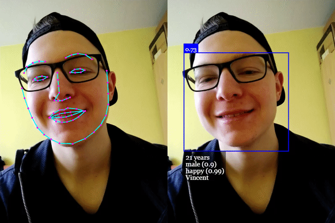

# 😊 Face Expression Detection App

A simple and interactive web application built with **face-api.js** to detect and analyze human facial expressions in real-time using the webcam.


---

## 🚀 Features

- 🔍 Real-time face detection from webcam
- 😄 Emotion recognition (Happy, Sad, Angry, etc.)
- 🎯 Uses powerful `face-api.js` models
- 🧠 Runs entirely in the browser — no backend required
- 📱 Works on most modern desktop and mobile browsers

---

## 📦 Built With

- [face-api.js](https://github.com/justadudewhohacks/face-api.js) — JavaScript API for face detection and recognition
- HTML5 + Vanilla JavaScript
- WebRTC (for accessing webcam)

---

## 📸 Demo

Try the live demo here:  
🔗 [https://face-detect.pages.dev/](https://face-detect.pages.dev/)  
*(Replace with your deployment URL)*

---

## 🧪 How It Works

1. Loads pretrained models (`tinyFaceDetector`, `faceExpressionNet`) from CDN/local.
2. Accesses the user's webcam using `navigator.mediaDevices`.
3. Continuously detects face and classifies facial expressions in real time.
4. Draws results on an overlaid canvas (bounding box + expression labels).

---

## 🛠️ Installation

1. **Clone the repo**

```bash
git clone https://github.com/nurulislamrimon/face-detect.git
cd face-detect


by Nurul Islam Rimon @Expertsquad.net